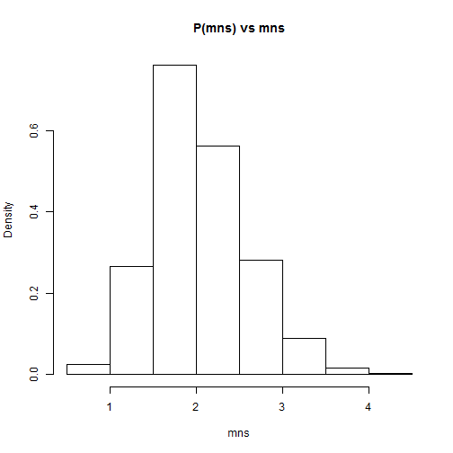

Illustrating Central Limit Theorem
========================================================
author: Siow Meng Low
date: 24 May 2015
id: title

Developing Data Products - Course Project

Shiny App, Presentation and R Code
========================================================

A R-based Shiny application is built to illustrate to users the principles 
of Central Limit Theorem by simulating the averages of independent random 
variables.

The following items are submitted as final deliverables 
of the course project: 

- Shiny App: A [Shiny App](https://siowmeng.shinyapps.io/shiny-CLT/) 
is deployed to shinyapps.io
- Rpubs Presentation: This presentation is built using Rstudio Presenter and 
published on [Rpubs](#/title)
- R code on GitHub: The R codes ui.R and server.R are shared on this
[GitHub Repository](https://github.com/siowmeng/DataProducts_Project)

CLT Application - Select Probability Distribution
========================================================

The application allows the users to specify the underlying probability 
distribution of the random variables. The following 3 types of probability 
distributions and their respective parameters can be specified:

- Exponential Distribution: The rate parameter (i.e. lambda $\lambda$)
- Uniform Distribution: The minimum and maximum values
- Normal Distribution: The mean (i.e. $\mu$) and variance (i.e. $\sigma^2$)

CLT Application - Central Limite Theorem Principles
========================================================

Using the slider, users also specify the number of observations, $n$, per 
simulation. For each simulation, the system takes the average value of the $n$ 
observations.

After 1000 simulations, the system will plot the 1000 averages in a histogram at 
the bottom of the right panel. From the histogram, it can be observed that with 
sufficiently large $n$, the histogram is approximately normally distributed with:

- The empirical mean approximates the theoretical mean, $\mu$, of the underlying 
distribution
- The empirical variance approximates the theoretical variance, of the underlying 
distribution, divided by number of observations (i.e. $\sigma^2/n$)

Sample Simulation
========================================================


```r
mns <- NULL
for (i in 1:1000)
        mns <- c(mns, mean(rexp(15, rate = 0.5)))
hist(mns, freq = FALSE, main = "P(mns) vs mns")
```

 


